# slidev-theme-narrative

A monochrome, one-accent, photography-forward [Slidev](https://sli.dev) theme.

The whole style is one durable system: a monochrome surface (black / white / gray),
generous whitespace, large confident titles, big full-bleed photography, and a
**single** accent color used sparingly. Mode (dark/light) and the accent are the
only per-deck inputs — choose them, write content, done. No per-deck CSS, layouts,
or components should be needed.

## Preview

Every layout shown in light and dark mode, with the default blue accent (`#3B82F6`).

<table>
  <tr>
    <th width="50%">Light</th>
    <th width="50%">Dark</th>
  </tr>
  <tr>
    <td align="center" colspan="2"><sub><code>cover</code> (identical in light and dark mode)</sub></td>
  </tr>
  <tr>
    <td colspan="2" align="center">
      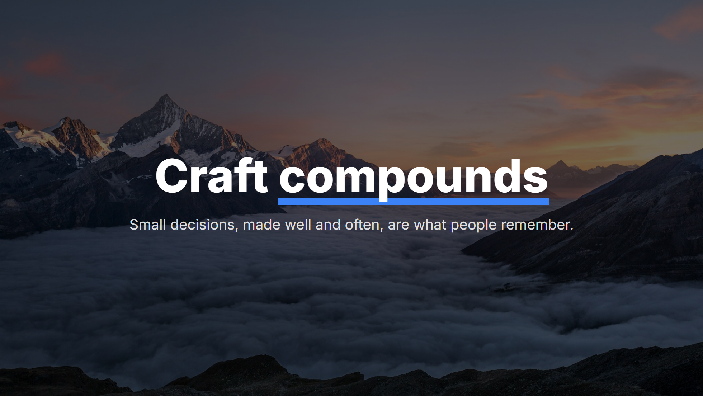
    </td>
  </tr>
  <tr>
    <td align="center" colspan="2"><sub><code>statement</code></sub></td>
  </tr>
  <tr>
    <td width="50%">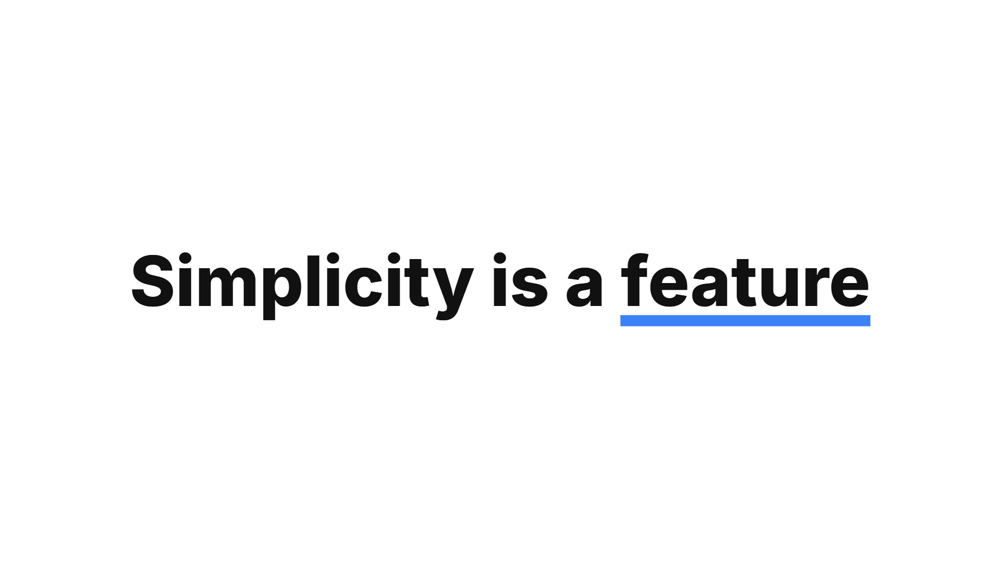</td>
    <td width="50%">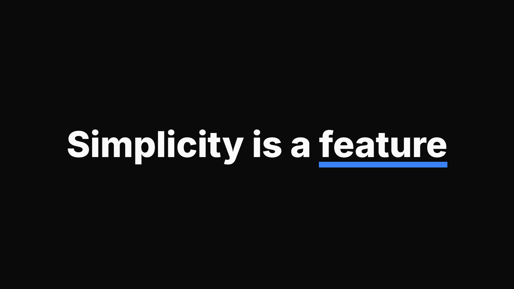</td>
  </tr>
  <tr>
    <td align="center" colspan="2"><sub><code>image-left</code></sub></td>
  </tr>
  <tr>
    <td width="50%">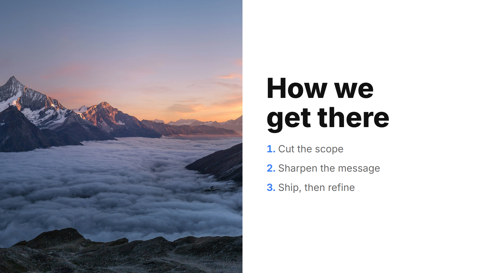</td>
    <td width="50%">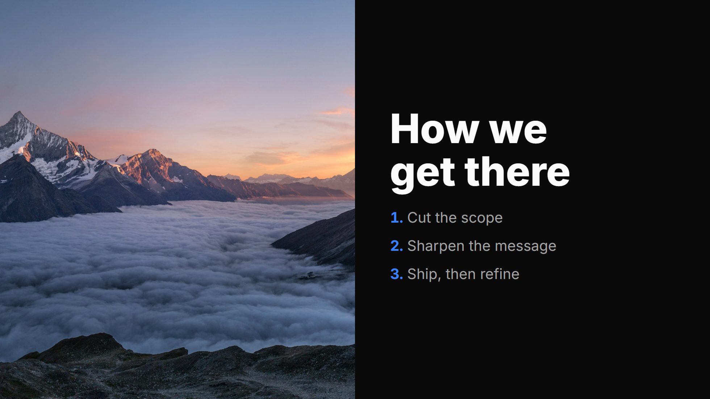</td>
  </tr>
  <tr>
    <td align="center" colspan="2"><sub><code>image-right</code></sub></td>
  </tr>
  <tr>
    <td width="50%">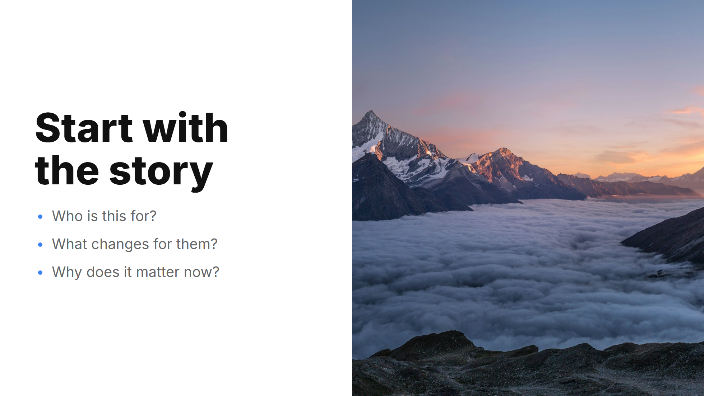</td>
    <td width="50%">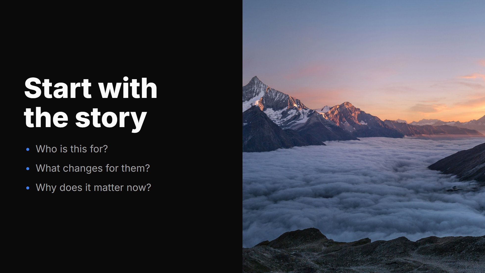</td>
  </tr>
  <tr>
    <td align="center" colspan="2"><sub><code>center</code></sub></td>
  </tr>
  <tr>
    <td width="50%">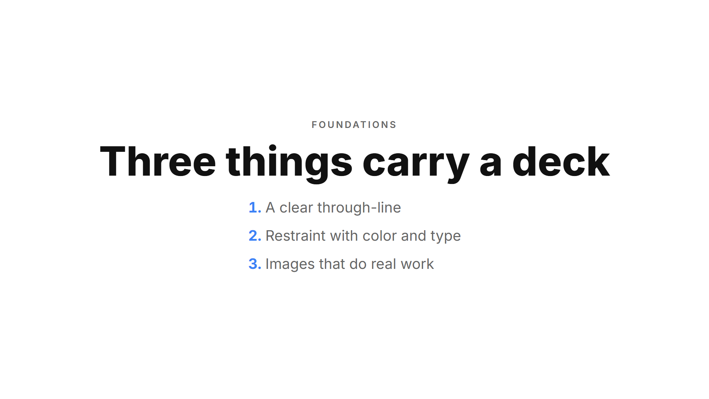</td>
    <td width="50%">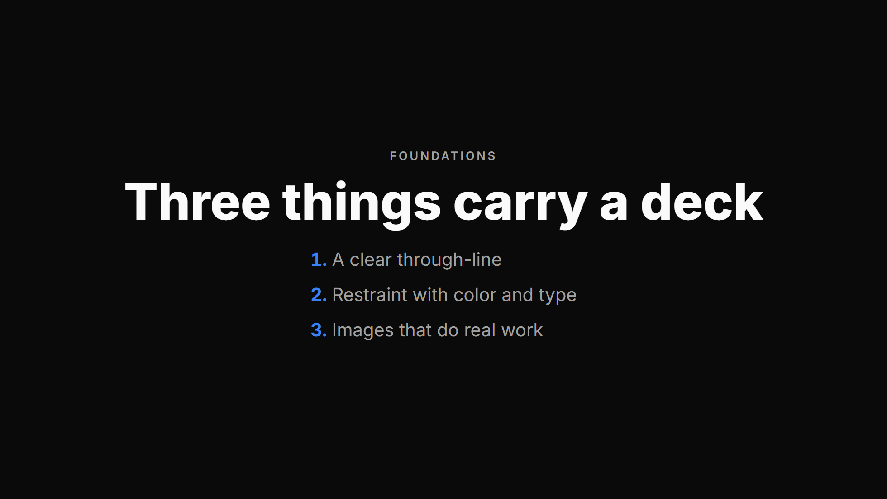</td>
  </tr>
  <tr>
    <td align="center" colspan="2"><sub><code>default</code></sub></td>
  </tr>
  <tr>
    <td width="50%">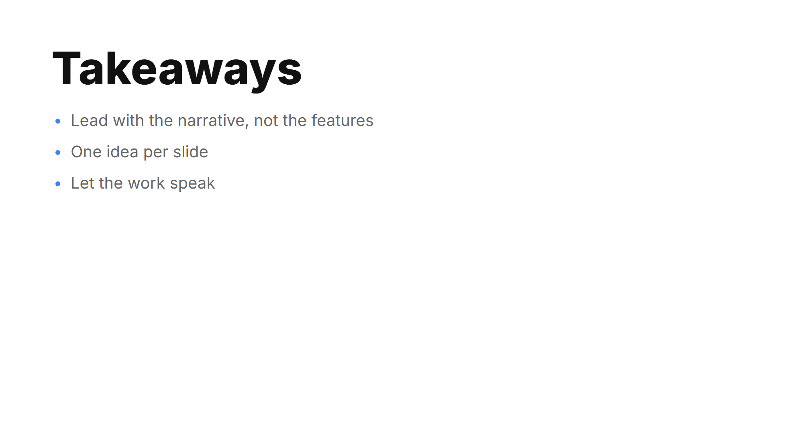</td>
    <td width="50%">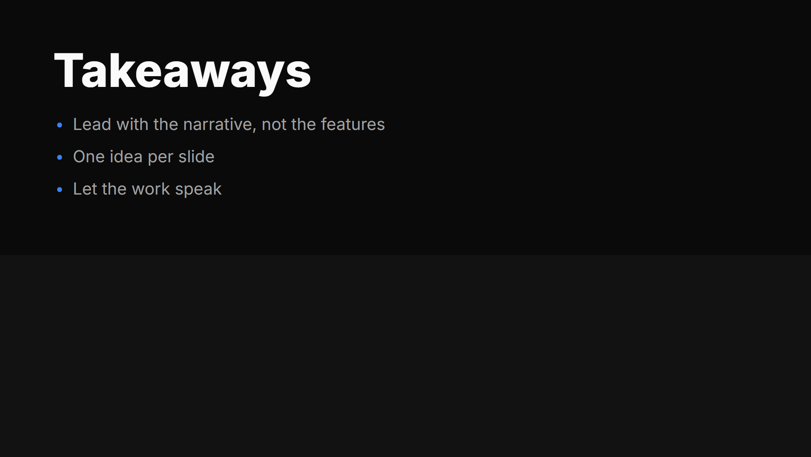</td>
  </tr>
</table>

## Usage

Install the theme:

```bash
npm install @ricoapon/slidev-theme-narrative
```

Then point your deck's headmatter at it (Slidev will also offer to install it
automatically on first run):

```yaml
---
theme: '@ricoapon/slidev-theme-narrative'
colorSchema: dark          # or: light
themeConfig:
  accent: '#3B82F6'        # the one accent for the whole deck (this is the default)
---
```

That's the entire configuration. Both decisions are real inputs:

| Input                  | Values                                    |
| ---------------------- | ----------------------------------------- |
| `colorSchema`          | `dark` (cinematic) · `light` (airy)       |
| `themeConfig.accent`   | any single hex color (e.g. red / blue / green) |

Suggested accents that read well on both modes:
`#3B82F6` blue (default) · `#E5484D` red · `#30A46C` green.

### Authoring skill

The theme ships with an opinionated companion skill (`skills/slidev-theme-narrative/SKILL.md`)
covering *how* to author a narrative deck with it — the three per-deck choices,
layout and imagery rules, and slide rhythm. Where this README is the reference,
the skill is the taste layer. Install it into your agent with:

```bash
npx skills add ricoapon/slidev-theme-narrative
```

## Color tokens

The theme exposes CSS variables you rarely need to touch directly. They react to
mode and accent automatically:

`--bg` · `--bg-alt` · `--text` · `--text-secondary` · `--hairline` · `--accent`

## Typography

- **Inter** (bundled, offline-safe) for everything, **Fira Code** for code.
- Big title, tiny support — the size contrast is the design. Sentence case titles.
- Accent shows up as: `**bold**` → accent word, `<u>underline</u>` → accent
  underline, links → accent. Keep it to one accent moment per slide.

## Layouts

All five are drop-in — no custom layouts required in a deck.

| Layout        | For…                                                | Frontmatter        |
| ------------- | --------------------------------------------------- | ------------------ |
| `cover`       | Title, section breaks, mood moments                 | `background: /x.jpg` |
| `statement`   | One punchy claim (3–6 words)                         | —                  |
| `center`      | Lists, steps, structured info, diagrams             | —                  |
| `image-left`  | A concept anchored to a photo                        | `image: /x.jpg`    |
| `image-right` | Mirror of `image-left` — alternate L/R               | `image: /x.jpg`    |
| `default`     | Plain padded content                                 | —                  |

Covers apply a scrim automatically so light titles stay readable over any photo.

The photo frontmatter (`background:` / `image:`) accepts either a **local path**
served from `public/` (`background: /cover.jpg`) or a **remote URL**
(`background: https://cover.sli.dev`). Local paths are rebased onto the deck's
base URL so they survive being served from a sub-path; URLs are used as-is.

## Components

The theme ships one small, generic building block; anything talk-specific belongs
in the deck's own `components/` folder, not here.

- `<Kicker>…</Kicker>` — the small uppercase eyebrow above a title.

## Utilities

- `.kicker`, `.accent`, `.muted` helper classes.
- Markdown ordered lists (`1.` / `2.`) render with accent numerals out of the box,
  so simple numbered takeaways need no component.

## Offline

Fonts are self-hosted via `@fontsource`, so a built deck presents with no network.
